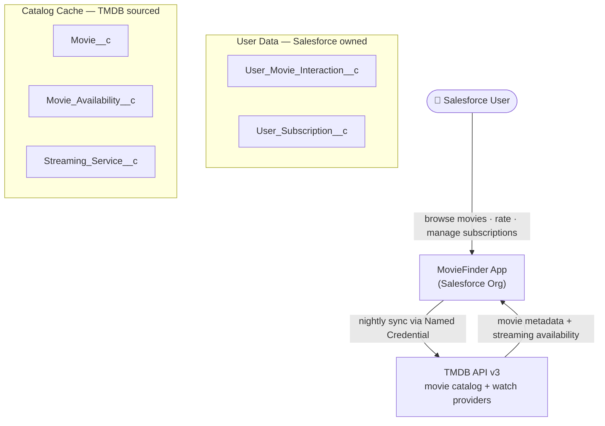
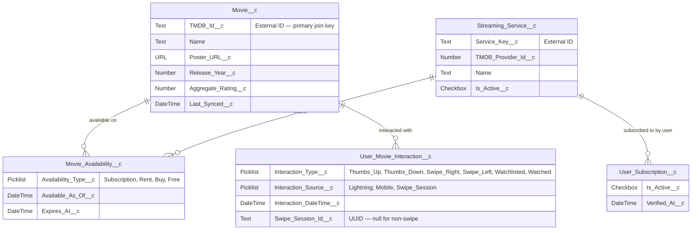
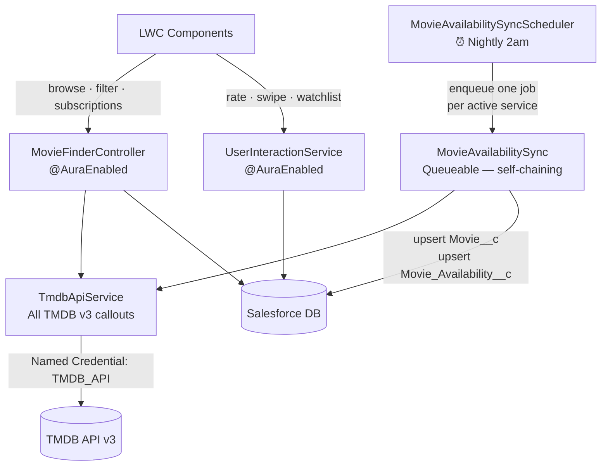
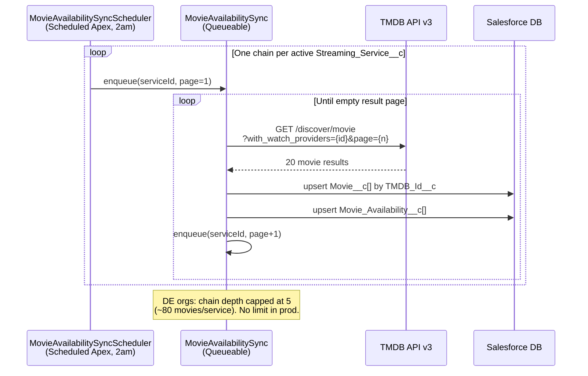
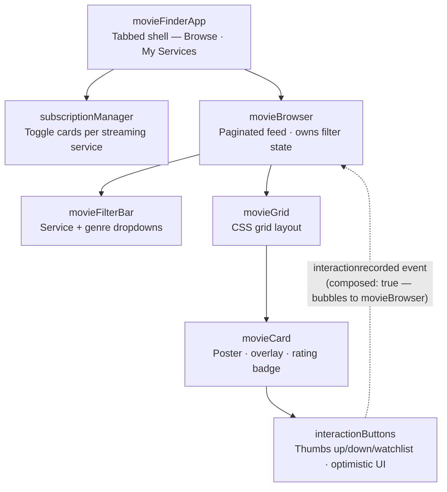
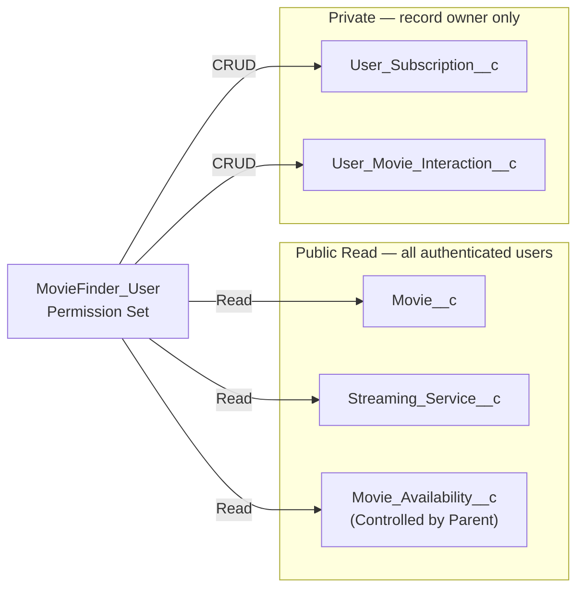

# MovieFinder — Project Overview

## Vision

MovieFinder is a Salesforce application that solves a simple problem: **what free movies can I watch right now across all my streaming services?**

The app aggregates movie availability across every streaming service the user subscribes to, surfaces them in a browsable UI, and lets the user rate movies (thumbs up/down) to help decide what to watch. Future phases will introduce a Tinder-style swipe interface and AI-powered recommendations.

---

## Roadmap

### Phase 1 — Internal Salesforce App ✅ (Complete)
- Browse all movies available on user's subscriptions
- Thumbs up / thumbs down rating
- Filter by streaming service
- Paginated movie grid with poster art
- User manages their own subscription list

### Phase 2 — Swipe UX + Mobile ✅ (Complete)
- Tinder-style swipe left (skip) / right (interested) on full-screen movie cards
- Swipe session tracking (grouped interactions)
- Salesforce Mobile app support
- Touch gesture support in LWC

### Phase 3 — AI Recommendations (Agentforce)
- Agentforce agent ranks movies based on user's interaction history
- "If you liked X, you'd like Y" pre-computed recommendation graph
- Natural language movie search ("show me 90s sci-fi on Netflix")
- Preference inference after 20+ rated movies

---

## Technical Architecture

### Core Principle: Hybrid Thin-Cache Model
Salesforce is the **system of record for user data** (subscriptions, ratings, interactions). TMDB is the **system of record for movie catalog data**. Movie records in Salesforce are a thin cache keyed by TMDB ID — not a full replica.

### API Strategy: TMDB (The Movie Database)
- **Free tier**, no monthly cap, commercial use allowed with attribution
- Single integration point replacing what would otherwise be N streaming service APIs
- Watch Providers endpoint returns flatrate/subscription availability by region
- `TMDB_Id__c` as external ID enables idempotent upserts on every sync
- Poster/backdrop images served directly from TMDB's CDN — no Salesforce storage cost

**Why not JustWatch?** Unofficial, undocumented API with no stable contract. Any UI refactor on their end silently breaks Apex callouts with zero warning.

**Why not individual streaming service APIs?** Netflix, Hulu, Disney+ do not have public OAuth APIs that allow third-party apps to query subscription catalogs. The user self-declares their subscriptions in `User_Subscription__c`; TMDB's Watch Providers data surfaces what's available on those services.

### Deployment Scope
Always deploy using the scoped manifest — never the full source directory (which includes standard org metadata with volatile ListViews):

```bash
sf project deploy start --manifest package-moviepicker.xml --target-org devorg
```

---

## Data Model

### `Streaming_Service__c`
Static reference catalog of streaming services. ~10–15 records, maintained manually.

| Field | Type | Notes |
|---|---|---|
| Name | Text | "Netflix", "Hulu", "Disney+" |
| Service_Key__c | Text(50), Ext ID | "netflix", "hulu" |
| TMDB_Provider_Id__c | Number | TMDB's integer ID (Netflix=8, Prime=9, Disney+=337) |
| Logo_URL__c | URL | |
| Is_Active__c | Checkbox | |

### `Movie__c`
Thin TMDB cache. Holds only what's needed to render a movie card without a round-trip.

| Field | Type | Notes |
|---|---|---|
| Name | Text | Movie title |
| TMDB_Id__c | Text(20), Ext ID | Primary join key to TMDB |
| Poster_URL__c | URL | Append to `https://image.tmdb.org/t/p/w500` |
| Backdrop_URL__c | URL | Append to `https://image.tmdb.org/t/p/w1280` |
| Release_Year__c | Number | Parsed from TMDB `release_date` |
| Genre_Tags__c | Text(255) | Comma-separated TMDB genre IDs |
| Runtime_Minutes__c | Number | Only populated via detail endpoint |
| Content_Rating__c | Picklist | G, PG, PG-13, R, NC-17, NR |
| Aggregate_Rating__c | Number(3,1) | TMDB vote_average (0–10) |
| Overview__c | LongTextArea | Short synopsis |
| TMDB_Popularity__c | Number | Used for default sort order |
| Last_Synced__c | DateTime | Cache invalidation |

### `User_Subscription__c` (OWD: Private)
The user's declared streaming service memberships. Drives the "free to you" filter.

| Field | Type | Notes |
|---|---|---|
| User__c | Lookup(User) | |
| Streaming_Service__c | Lookup(Streaming_Service__c) | |
| Is_Active__c | Checkbox | |
| Verified_At__c | DateTime | Future: OAuth verification timestamp |

### `Movie_Availability__c` (Master-Detail → Movie__c)
Junction: this movie is free on this service right now. Most volatile data — refreshed nightly.

| Field | Type | Notes |
|---|---|---|
| Movie__c | MasterDetail(Movie__c) | |
| Streaming_Service__c | Lookup(Streaming_Service__c) | |
| Availability_Type__c | Picklist | Subscription, Rent, Buy, Free |
| Available_As_Of__c | DateTime | |
| Expires_At__c | DateTime | When known |

### `User_Movie_Interaction__c` (OWD: Private)
All user ratings and future swipe decisions. One object handles both current and Phase 2 UX.

| Field | Type | Notes |
|---|---|---|
| User__c | Lookup(User) | |
| Movie__c | Lookup(Movie__c) | |
| Interaction_Type__c | Picklist | Thumbs_Up, Thumbs_Down, Swipe_Right, Swipe_Left, Watchlisted, Watched |
| Interaction_Source__c | Picklist | Lightning, Mobile, Swipe_Session |
| Interaction_DateTime__c | DateTime | |
| Swipe_Session_Id__c | Text(36) | UUID grouping a single swipe session — null for non-swipe interactions |

**Business rule:** A user can only have one active Thumbs_Up **or** Thumbs_Down per movie — toggling one removes the other. Implemented in `UserInteractionService`.

---

## Apex Layer

| Class | Purpose |
|---|---|
| `TmdbApiService` | All TMDB v3 callouts. Cached config via `TMDB_Config__mdt`. Named Credential `TMDB_API`. |
| `MovieFinderController` | `@AuraEnabled` methods for LWC: browse movies, get/upsert subscriptions. |
| `UserInteractionService` | Thumbs up/down (with mutual exclusivity), swipe session management, watchlist. |
| `MovieAvailabilitySync` | Queueable that pages through TMDB `/discover/movie` for one provider, upserts `Movie__c` and `Movie_Availability__c`. Chains to next page automatically. |
| `MovieAvailabilitySyncScheduler` | Scheduled Apex entry point. Fires nightly at 2am, enqueues one `MovieAvailabilitySync` per active streaming service. |

**Nightly sync schedule (to activate):**
```apex
System.schedule('MovieFinder Nightly Sync', '0 0 2 * * ?', new MovieAvailabilitySyncScheduler());
```

### TMDB API Key Setup
The API key lives only in the org — never in source control.

1. Go to Setup → Custom Metadata Types → TMDB Config → Manage Records
2. Edit the **Default** record
3. Paste your TMDB v3 API key into the `API Key` field

Or via SFDX (replace the placeholder before deploying):
```
force-app/main/default/customMetadata/TMDB_Config.Default.md-meta.xml
```

---

## Application Shell

### Custom Lightning App — `MovieFinder`
`force-app/main/default/applications/MovieFinder.app-meta.xml`

A Standard Lightning app with a single nav tab that lands directly on the LWC. No utility bar; no console layout.

### Custom Tab — `MovieFinder`
`force-app/main/default/tabs/MovieFinder.tab-meta.xml`

A Lightning Component tab (`lwcComponent: movieFinderApp`) — renders the root LWC directly without a Flexipage layer. The LWC exposes `lightning__Tab`, `lightning__AppPage`, and `lightning__HomePage` targets.

### CSP Trusted Site — Required for Poster Images
TMDB poster images are loaded directly from `https://image.tmdb.org` in the browser. Salesforce's Content Security Policy blocks external image domains by default. Without this, the `` handler fires and the fallback title div is shown instead of the poster.

**Setup → Security → CSP Trusted Sites → New:**
| Field | Value |
|---|---|
| Name | `TMDB_Images` |
| Trusted Site URL | `https://image.tmdb.org` |
| Context | All (or img-src) |

---

## LWC Component Hierarchy

```
movieFinderApp        — Tabbed shell: "Browse" + "My Services"
  ├── subscriptionManager   — Toggle cards for each streaming service
  └── movieBrowser          — Paginated movie feed, manages filter state
       ├── movieFilterBar    — Service/genre filter dropdown
       └── movieGrid         — CSS grid of movie cards
            └── movieCard    — Poster, overlay, rating badge
                 └── interactionButtons  — Thumbs up/down/watchlist with optimistic UI
```

**Key design decisions:**
- `movieBrowser` uses `@api get/set` on `serviceFilter` to detect parent-driven property changes and reset + reload the movie list
- `interactionButtons` updates local state optimistically before the Apex round-trip completes, reverts on failure
- `interactionrecorded` custom event bubbles with `composed: true` up through `movieCard → movieGrid → movieBrowser` where it updates the movies array to re-render
- TMDB poster images use the CDN directly (`https://image.tmdb.org/t/p/w500{posterPath}`) — no Salesforce Files storage

---

## Security Model

| Object | OWD | Notes |
|---|---|---|
| Movie__c | Read/Write (Public Read) | Catalog data — all users see all movies |
| Streaming_Service__c | Read/Write (Public Read) | Reference data |
| User_Subscription__c | Private | Users see only their own subscriptions |
| Movie_Availability__c | Controlled by Parent | Inherits from Movie__c |
| User_Movie_Interaction__c | Private | Users see only their own interactions |

**Permission Set:** `MovieFinder_User` grants all necessary object/field access. Assign to any user who should access the app.

All Apex controller classes use `with sharing` — sharing rules are enforced on all SOQL queries.

---

## Dev Org Notes

### Queueable Chain Depth Limit
Developer Edition orgs cap Queueable chain depth at 5. `MovieAvailabilitySync` chains one job per TMDB page, so it stops after page 5 (~80 movies per service) in a DE org. **This is not a production issue** — production and sandbox orgs have no chain limit. The nightly scheduler will page through all 500 TMDB pages without hitting this limit in prod.

**Workaround for more data in a DE org:** Enqueue pages independently from Anonymous Apex (each call is a fresh chain, not a continuation):
```apex
Id svcId = [SELECT Id FROM Streaming_Service__c WHERE Service_Key__c = 'netflix' LIMIT 1].Id;
System.enqueueJob(new MovieAvailabilitySync(svcId, 5));
System.enqueueJob(new MovieAvailabilitySync(svcId, 9));
// etc.
```

### Async Debug Logs
Queueable jobs run in a separate execution context — Developer Console logs from Anonymous Apex won't include them. To see job output:
1. Setup → Debug Logs → New → add **"Automated Process"** entity at Apex Code: FINEST
2. Or: `sf apex tail log --color --target-org devorg` (streams all entities in real time)

---

## Deployment Checklist

- [x] Add TMDB API key to `TMDB_Config__mdt` Default record in the org *(Setup → Custom Metadata Types → TMDB Config → Manage Records → Default)*
- [x] Deploy using `sf project deploy start --manifest package-moviepicker.xml --target-org devorg`
- [x] Seed `Streaming_Service__c` records — Netflix=8, Amazon Prime=9, Disney+=337, Hulu=15, Max=1899, Apple TV+=350
- [x] Run nightly sync manually to seed initial movie catalog
- [x] Custom Lightning App (`MovieFinder`) and Tab deployed — accessible from App Launcher
- [x] Assign `MovieFinder_User` permission set to users
- [x] Add CSP Trusted Site for `https://image.tmdb.org` (required for poster images)
- [x] Schedule the nightly job: `System.schedule('MovieFinder Nightly Sync', '0 0 2 * * ?', new MovieAvailabilitySyncScheduler())`

---

## Phase 2 Punchlist — Swipe UX + Mobile

> **Panel note (2026-04-22):** Before writing any swipe code, the panel identified that `Swipe_Session_Id__c` as a bare Text(36) UUID is the wrong abstraction for shared sessions. The Architecture section below must be completed first — it unblocks clean Apex method signatures, LWC contracts, and the sharing model before any of those are built.

### Architecture / Data Model

- [x] Create `Swipe_Session__c` custom object — fields: `Owner_User__c` (Lookup → User), `Status__c` (Picklist: Active, Completed), `Started_At__c` (DateTime), `Ended_At__c` (DateTime), `Movie_Queue__c` (LongTextArea — queue snapshot). OWD: Private.
- [x] Replace `Swipe_Session_Id__c` Text(36) on `User_Movie_Interaction__c` with a Lookup to `Swipe_Session__c` (field API name: `Swipe_Session__c`)
- [x] Create `MatchDetectionService.cls` stub — `without sharing`, empty body, sharing rationale documented in comments
- [x] Add `Swipe_Session__c` to `package-moviepicker.xml` and `MovieFinder_User` permission set

### Apex

- [x] `UserInteractionService.startSwipeSession()` — inserts a `Swipe_Session__c` record (Status=Active, Started_At=now), returns Salesforce Id
- [x] `UserInteractionService.recordSwipe(movieId, direction, sessionId)` — inserts/updates `User_Movie_Interaction__c` with Swipe_Right or Swipe_Left, Lookup to `Swipe_Session__c`
- [x] `UserInteractionService.getNextSwipeMovie(sessionId)` — snapshots eligible movie queue into `Movie_Queue__c` on first call, returns next un-swiped `Movie__c`
- [x] `SwipeSessionSummaryDto` inner class — `swipedRight`, `swipedLeft`, `matchCount` (default 0, wired to `MatchDetectionService` in Phase 3)
- [x] `UserInteractionService.endSwipeSession(sessionId)` — marks session Completed, stamps `Ended_At__c`, returns `SwipeSessionSummaryDto`
- [x] 16-test coverage: all swipe methods, deck exhaustion, no-subscription, and two-user same-movie collision assertion

### LWC — New Components

- [x] `swipeCard` — full-screen movie card with touch + mouse drag, real-time `translateX + rotate` transform, green/red tint overlay, LIKE/SKIP stamps, fly-out animation, `swiped` event `{ direction, movieId, sessionId }`
- [x] `swipeSession` — async session orchestrator; keyed `for:each` forces fresh `swipeCard` instances per movie; fire-and-forget `recordSwipe`; `sessionEnded` event with `SwipeSessionSummaryDto`

### LWC — Integration

- [x] Swipe tab added to `movieFinderApp` alongside Browse and My Services
- [ ] Add MovieFinder to Salesforce Mobile Navigation (Setup → Salesforce Mobile App → Navigation → add MovieFinder tab)
- [ ] Smoke-test swipe gestures on a real iOS/Android device via Salesforce Mobile app

### Deployment

- [x] `package-moviepicker.xml` updated with `swipeCard`, `swipeSession`, `Swipe_Session__c` object and fields
- [x] Deployed successfully — 67/67 components, 0 errors (2026-04-27)

---

## Architecture Diagrams

> Diagrams use [Mermaid](https://mermaid.js.org/) and render natively on GitHub. In VS Code, install the [Mermaid Preview](https://marketplace.visualstudio.com/items?itemName=bierner.markdown-mermaid) extension. Editable draw.io source files live in [`docs/diagrams/`](docs/diagrams/) — open with the [Draw.io Integration](https://marketplace.visualstudio.com/items?itemName=hediet.vscode-drawio) extension.

### System Context



---

### Data Model



---

### Apex Service Layer



---

### Nightly Sync Sequence



---

### LWC Component Hierarchy



---

### Security Model



---

## Repository

GitHub: [https://github.com/taylorpoppell92/MovieFinder](https://github.com/taylorpoppell92/MovieFinder)  
Connected Org: `devorg` (taylor.poppell.fb42c566d1da@agentforce.com)  
API Version: 66.0
